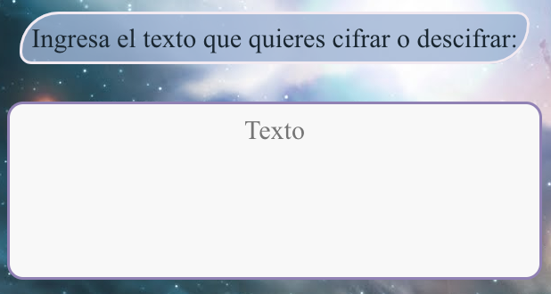
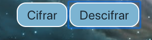

# Cifrado César 
En esta pagina web, podras cifrar y descifrar el texto que tu quieras.

En el primer parrafo podras acceder a un link que dice "aquí" donde podrás leer acerca del Código Cesar y saber de lo que se trata.
Luego de éste parrafo debes ingresar en la figura ovalada (que dice "Desplazaminto"), el número de desplazamiento que quieres aplicar para cifrar el texto. Como aparece en la imagen. 

Luego debes ingresar el texto que quieres cifrar/descifrar.

Una vez ingresado el texto debes hacer click en la opción cifrar o descifrar.

Y va aparecer el texto cifrado y/o descifrado.

## **Sobre la página web**

- Los principales usuarios del producto son todos aquellos que estan interesados o buscan una pagina web que les codifique un texto. 

- El objetivo es codificar un texto, cuyos motivos de los usuarios son diversos.

- Es una pagina web que estructuralemente es ordenada y entendible para el usuaro pero el objetivo se cumple 80% dado a que al momento de descifrar el texto aparecen caracteres que no corresponden como @, &, etc.

- Mi organización mediante Trello: https://trello.com/b/HqIL2wUI.

